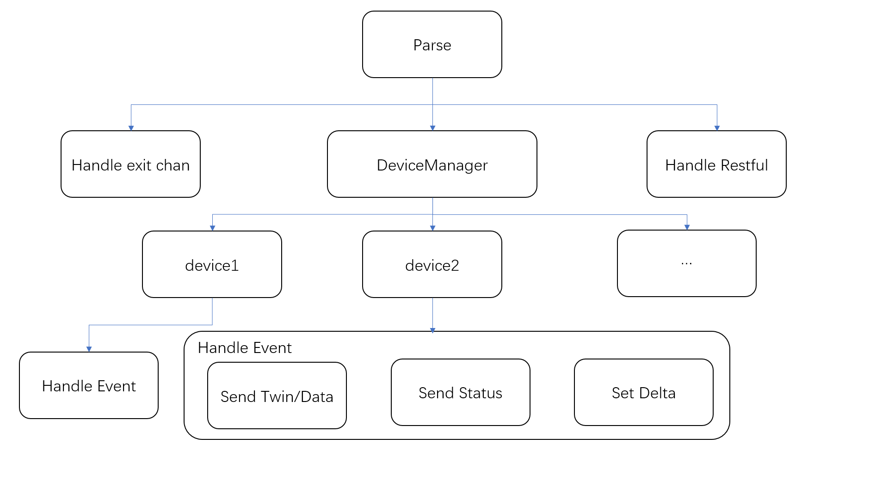

# Mapper-go-sdk Design
## Introduction
The original description could refer to the doc [mapper-design-v2.md](https://github.com/kubeedge/kubeedge/blob/master/docs/proposals/mapper-design-v2.md)  
Mapper is the bridge between kubeedge and the device. Mapper can be used to set the config of the device, read the required data from the device and control the device drive. And Mapper can report the data and device status read from the device to the cloud through mqtt broker and restful, or manage the device driver.
One mapper is for one type of device and could control multiple devices simultaneously.

The first step to control a device is to configure the device model and device instance. After that, a configmap is generated([configmap example](https://github.com/kubeedge/kubeedge/blob/master/docs/proposals/device-management-enhance.md)).
Mapper will parse the configmap when starting. At run time, the configuration could be changed and the configmap will follow the change, device twin will also send out changing messages.

About the device control/data, there're three types:
  1. Twin/Data Value:  
```json
"twins":[{
    "propertyName":"io-data",
    "desired":{
        "value":"1",
        "metadata":{
            "type":"int"
        }
    },
    "reported":{
        "value":"unknown"
    }
}]
```
The desired value will be set to the device, the reported value is from device and sent to the device controller. User could define the collect/report cycle and times.
 2. State:  
Device status. Device status will be collected periodically and sent to device controller.
## Motivation
Decouple the device driver part from the cloud side communication part, so that mapper developers can focus on the control of the device. Provide restful API for more convenient access to third-party apps.  

### Goals
- Decouple structure
- Extract SDK
- Provide RESTful API
- Dynamic add / delete device (Memory Level)
### Non-goals
- Stream/big package data transportation
- Data persistence
## Architecture
Components are as below:

1. North docking layer: the current version provides two ways to connect with the north, mqtt and restful.
- Mqtt is the default open component. It will send data, twin, status and other attributes to mqtt broker regularly according to configmap.
- The eventbus module of edgecore will interact with the broker to realize data reporting at the edge and command issuing in the cloud. Restful will automatically generate an API according to the accessmode attribute of the device for the third-party app to obtain the device data and control the writable device in the form of restful.
2. SDK implementation layer
- **Parser** used to read the corresponding config file and parse it into the data structure inside the SDK.
- **MqttAdapter** used for mapper event management. It includes the processing of mqtt subject message events transmitted from the north and the processing of device twin message events.
- **HttpAdapter** http controller. Used to initialize restful routes, route management and return response messages.
- **HealthCheck** used to check the health status of mapper components.(will only be submitted to the cloud)
- **BootStrap** used to start the entire mapper and perform initialization.
- **DeviceManger** used to manage the lifecycle of the device. It includes dynamically updating device, adding new device, deleting device, obtaining device status, etc
- **DeviceCommand** used to operate the device.  Like get device data, update device config, etc.
- **AutoDiscovery** used to reserved device driver interface is used for automatic discovery of device. However, it is not implemented in this version
3. Driver interface layer: provides the interface and structure for building mapper device services.
### Routine
The main routine is as:


### Supported Topics 
	TopicTwinUpdateDelta = "$hw/events/device/%s/twin/update/delta"
	TopicTwinUpdate      = "$hw/events/device/%s/twin/update"
	TopicStateUpdate     = "$hw/events/device/%s/state/update"
	TopicDataUpdate      = "$ke/events/device/%s/data/update"
	TopicDeviceUpdate    = "$hw/events/node/#"
### Supported RESTful API
Port ```1215``` is enabled by default.


```deviceInstances-ID```  
according to your own CRD definition

```propertyName```  
according to your own CRD definition
1. Detect whether the RESTful service starts normally  
   Method=<font color=green>**GET**</font>   
   https://127.0.0.1:1215/api/v1/ping

2. Get device's property  
   Method=<font color=green>**GET**</font>  
   `https://127.0.0.1:1215/api/v1/device/id/deviceInstances-ID/propertyName`

3. Set device's config  
   Method=<font color=#60D6F4>**PUT**</font>
   https://127.0.0.1:1215/api/v1/device/id/deviceInstances-ID?propertyName=Value
4. Add a deviceInstance  
   Method=<font color=orange>**POST**</font>  
   https://127.0.0.1:1215/api/v1/callback/device  
   You must provide a JSON body that conforms to the CRD definition
5. Delete a deviceInstance  
   Method=<font color=#FF5555>**DEL**</font>
   https://127.0.0.1:1215/api/v1/callback/device/id/deviceInstances-ID
### Security

#### MQTT
Developers need to configure their own authentication keys. Mapper-sdk enables server-side security authentication by default, but does not enable client-side authentication. If necessary, we will add it in the next version.
Developers need to provide the root certificate path, client key path and client certificate path in the `config.yaml` file.

#### RESTful
Developers need to configure the authentication key by themselves. By default, mapper-sdk enables https two-way security authentication for restful interfaces. The authentication of the client to the server needs to be implemented by the developer.
Developers need to provide the root certificate path, server key path and server certificate path in the config.yaml file.
